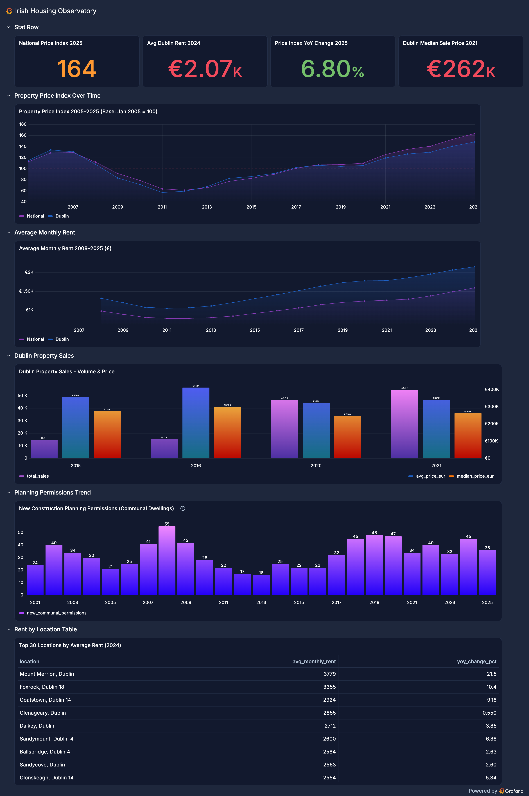
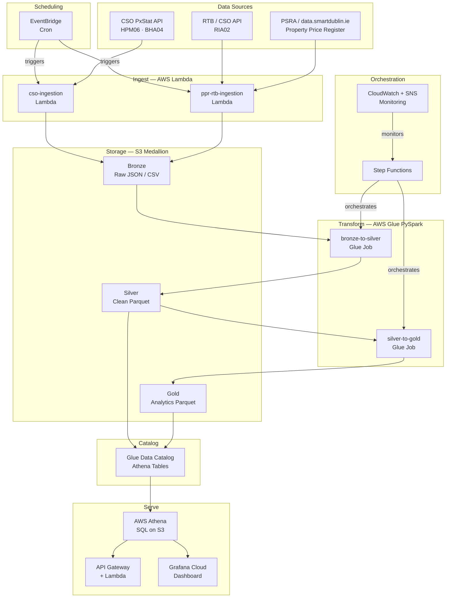

# Irish Housing Observatory

An end-to-end AWS data engineering pipeline that automatically collects, transforms, and serves Irish housing and rental market data - built to understand one of Ireland's most pressing social crises.

## Live Links

| | |
|---|---|
| 📊 **Dashboard** | [zestybutterfly164.grafana.net/public-dashboards/c1be1ce5a8e84346a55aaf3c51dd0df6](https://zestybutterfly164.grafana.net/public-dashboards/c1be1ce5a8e84346a55aaf3c51dd0df6) |
| 🔌 **API** | [i969tsu6e3.execute-api.us-east-1.amazonaws.com/health](https://i969tsu6e3.execute-api.us-east-1.amazonaws.com/health) |

## Dashboard Preview



---

## Problem Statement

Ireland is in a housing crisis. Average Dublin rents reached **€2,157/month in 2025**, more than double the 2011 low. The national property price index hit **163.6 in 2025** - up 63% from the 2005 base. Housing completions fall short of the estimated 35,000/year needed. Yet there is no single automated platform that aggregates all public housing data - CSO property prices, RTB rents, planning permissions, property sales - into one queryable, up-to-date system.

This pipeline fills that gap.

---

## Architecture



---

## Data Sources

| Source | Dataset | Coverage | Update frequency |
|--------|---------|----------|-----------------|
| CSO PxStat API | Residential Property Price Index (HPM06) | 2005–present | Monthly |
| CSO PxStat API | Planning Permissions for Communal Dwellings (BHA04) | 2001–present | Annual |
| CSO / RTB | Average Monthly Rent by Location (RIA02) | 2008–present | Quarterly |
| PSRA / data.smartdublin.ie | Property Price Register - Dublin | 2015, 2016, 2020, 2021 | Monthly |

---

## Tech Stack

| Layer | Tool | Purpose |
|-------|------|---------|
| **Ingestion** | AWS Lambda (Python 3.12) | Serverless HTTP ingestion from public APIs |
| **Scheduling** | AWS EventBridge | Cron-style triggers for Lambda |
| **Storage** | AWS S3 - Bronze / Silver / Gold | Medallion architecture in Parquet |
| **Transformation** | AWS Glue 4.0 (PySpark) | Schema enforcement, cleaning, aggregation |
| **Orchestration** | AWS Step Functions | Pipeline coordination and retry logic |
| **Catalog** | AWS Glue Data Catalog | Schema registration for Athena |
| **Query engine** | AWS Athena | SQL on S3 Parquet |
| **API** | AWS API Gateway + Lambda | REST API serving Gold data as JSON |
| **Dashboard** | Grafana Cloud | Live visualisation via Athena data source |
| **Monitoring** | AWS CloudWatch + SNS | Logs, alerts, pipeline failure emails |

---

## REST API

Base URL: `https://i969tsu6e3.execute-api.us-east-1.amazonaws.com`

| Method | Endpoint | Description |
|--------|----------|-------------|
| GET | `/health` | Service status |
| GET | `/summary` | Full housing crisis summary by year |
| GET | `/rents` | Rent trends - filter by `?location=Dublin&from_year=2016` |
| GET | `/prices` | Price index - filter by `?type=National&from_year=2010` |
| GET | `/sales` | Dublin property sales by year |

**Example:**
```bash
curl "https://i969tsu6e3.execute-api.us-east-1.amazonaws.com/rents?location=Dublin&from_year=2020"
```

```json
{
  "status": "ok",
  "data": [
    {
      "location": "Dublin",
      "year": 2020,
      "avg_monthly_rent": 1779.11,
      "yoy_change_pct": 2.22
    }
  ],
  "meta": {
    "table": "gold_avg_rent_by_location_year",
    "row_count": 5
  }
}
```

---

## Gold Layer - Analytics Tables

Five pre-aggregated tables in the Gold layer, queryable via Athena and the REST API:

| Table | Source | Rows | Description |
|-------|--------|------|-------------|
| `gold_property_price_index` | HPM06 | 1,530 | Monthly price index by property type, pivoted wide |
| `gold_avg_rent_by_location_year` | RIA02 | 8,028 | Annual avg rent by location with YoY change |
| `gold_planning_permissions_trend` | BHA04 | 25 | Annual new construction permissions with YoY change |
| `gold_property_sales_dublin` | PPR | 4 | Annual Dublin sales: volume, avg/median price, new vs second-hand |
| `gold_housing_crisis_summary` | All | 25 | One row per year joining all four sources |

---

## Silver Layer - Cleaned Tables

| Table | Source | Rows | Key transformations |
|-------|--------|------|-------------------|
| `silver_cso_house_price_index` | HPM06 | 20,400 | JSON-stat2 unpacked, dimension labels applied, year extracted |
| `silver_cso_new_dwelling_completions` | BHA04 | 200 | JSON-stat2 unpacked, typed |
| `silver_rtb_rent_by_county` | RIA02 | 337,176 | Code columns dropped, label columns kept, VALUE cast to double |
| `silver_ppr_sales_register` | PPR | ~130,000 | Per-year read to handle schema mismatch, latin-1 decoded, dates normalised, prices cleaned |

---

## Project Structure

```
irish-housing-observatory/
├── ingestion/
│   └── lambdas/
│       ├── cso_ingestion/
│       │   └── lambda_function.py      # CSO PxStat JSON-RPC ingestion
│       └── ppr_rtb_ingestion/
│           └── lambda_function.py      # PPR CSV + RTB ingestion
├── transform/
│   ├── glue_jobs/
│   │   ├── bronze_to_silver.py         # PySpark Bronze -> Silver
│   │   └── silver_to_gold.py           # PySpark Silver -> Gold
│   └── tests/
│       ├── test_bronze_to_silver.py    # 42 tests
│       └── test_silver_to_gold.py      # 72 tests
├── api/
│   ├── lambda/
│   │   └── api_handler.py              # REST API Lambda
│   └── tests/
│       └── test_api_handler.py         # 57 tests
├── infrastructure/
│   ├── iam/
│   │   └── policies.md                 # IAM roles documented
│   └── s3/
│       └── bucket_structure.md         # S3 layout documented
└── docs/
    └── images/
        └── dashboard.png               # Grafana dashboard screenshot
```

---

## Key Engineering Decisions

**Why per-file CSV reading for PPR?**
The 2015–2020 PPR files have a `Postal Code` column; the 2021 file has `Eircode` instead. Reading all files together caused Spark to lock onto the first file's schema and null-fill the 2021 date column. Reading each file individually then using `unionByName(allowMissingColumns=True)` solved this cleanly.

**Why `df.cache()` after the union?**
Spark DataFrames are lazily evaluated - every action re-executes the full plan from scratch. The 2021 PPR file has complex address fields with embedded commas, so the CSV parser split rows differently on each scan, producing non-deterministic null counts. Caching forces a single S3 read; all subsequent actions use the same in-memory result.

**Why pivot the price index?**
The CSO HPM06 dataset arrives in long format - four metric types stacked as separate rows per region per month. Grafana and SQL consumers work better with wide format. `pivot()` reshapes it so each metric becomes its own column - one row per region per month.

**Why a year spine + LEFT JOIN for the summary table?**
Each data source covers different years (BHA04 from 2001, HPM06 from 2005, RTB from 2008, PPR from 2015). An inner join would return only 2020–2021. Building a year spine from all distinct years across all sources and LEFT JOINing preserves the full historical picture with nulls where data doesn't exist.

**Why `date_parse(CAST(year AS VARCHAR), '%Y')` in Grafana queries?**
Integer year columns (2005, 2006...) are interpreted by Grafana as Unix timestamps in seconds - making 2005 render as 05:33:25 on 1 Jan 1970. Converting to a proper timestamp in Athena SQL before the data reaches Grafana fixes the time axis correctly.

---

## Cost

Designed to run within AWS Free Tier. Estimated monthly cost at this data scale:

| Service | Cost |
|---------|------|
| Lambda | Free (well within 1M requests/month free tier) |
| S3 | Free (< 5GB total) |
| Glue | ~$0.15 per job run (only cost during development runs) |
| Athena | ~$0.01/month (small Parquet files, minimal scans) |
| EventBridge | Free |
| Step Functions | Free tier |
| API Gateway | Free tier (< 1M requests/month) |
| **Total** | **< $3/month** |

---

## Build Phases

- [x] Phase 1 - Bronze ingestion (CSO, RTB, PPR via Lambda)
- [x] Phase 2 - Silver transformation (Glue PySpark, all sources clean)
- [x] Phase 3 - Gold aggregations (5 analytics tables)
- [x] Phase 4 - REST API (API Gateway + Lambda + Athena)
- [x] Phase 4 - Grafana dashboard (6 panels, public link)
- [x] Phase 5 - EventBridge scheduling + Step Functions orchestration
- [ ] Phase 6 - Terraform infrastructure-as-code

---

## Tests

| Module | Test file | Count |
|--------|-----------|-------|
| Bronze -> Silver | `transform/tests/test_bronze_to_silver.py` | 42 |
| Silver -> Gold | `transform/tests/test_silver_to_gold.py` | 72 |
| API handler | `api/tests/test_api_handler.py` | 57 |
| **Total** | | **171** |

Run locally (no AWS dependency):
```bash
python -m pytest transform/tests/ api/tests/ -v
```

---

## Data Notes

- PPR data covers Dublin only (national data not available via stable direct download link)
- BHA04 covers planning permissions for **communal dwellings** only, not total housing supply
- RTB rent data starts from 2008; earlier years have null rent values in the summary table
- Property sales gaps (2017–2019, 2022–2023) reflect ingested years only, not missing data in the source

---

*Data sourced from CSO, RTB, and PSRA — all publicly available Irish government datasets.*